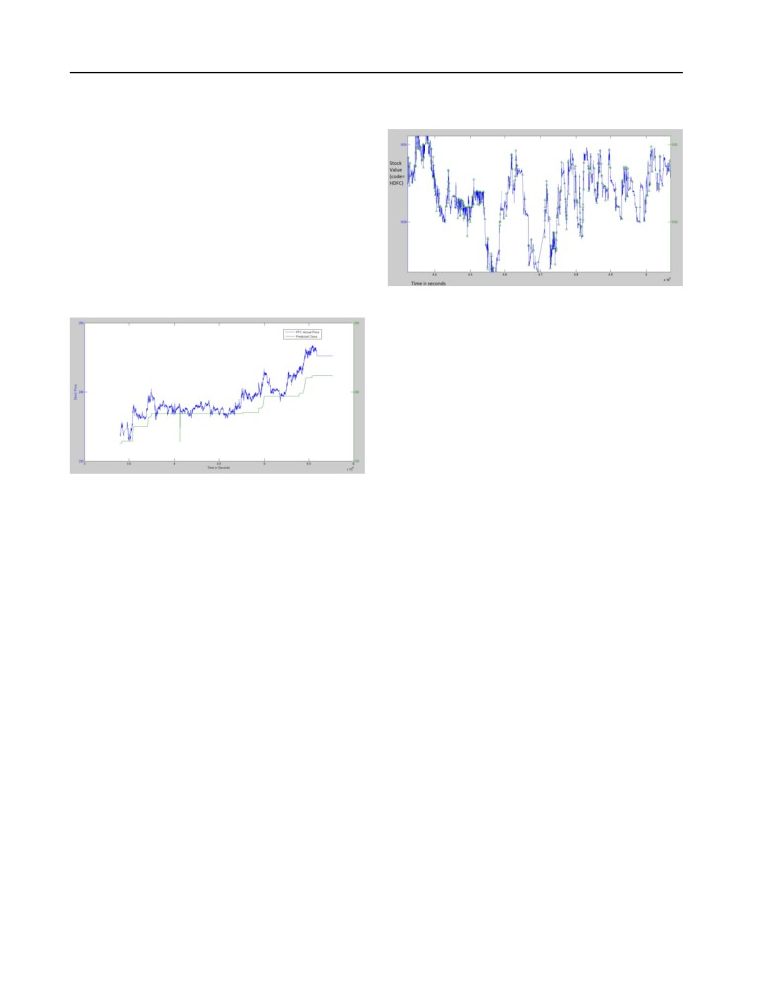

<html>
<head><meta http-equiv=Content-Type content="text/html; charset=UTF-8">

</head>
<body>

000

055

001

056

002

High Frequency Trading by Transient Profit Peak Classification

057

003

058

using Machine Learning on Real-Time Data Streams

004

059

005

060

006

061

007

062

Vishnu Srivastava

v2srivas@uwaterloo.ca

008

063

University of Waterloo, ON, Canada N2L 3G1

009

064

010

065

011

066

012

Abstract

2. Description of the Available Data

067

013

068

014

The data is available for 136 stocks of NSE India in two

069

015

Predicting the movement of the stock prices

forms which can be classified as historic data and live

070

016

has  been  a  major  area  of  implementation

streaming data.Both of these data have been utilized

071

017

of Machine Learning algorithms but due to

in formation of different features.

072

018

large data processing and limited comput-

073

019

ing capability,  most of this has been lim-

2.1. Historic Data

074

020

ited to long term predictions.  Caching fea-

075

This data comprises of the change in price of a stock

021

ture provides an alternative but it’s not suf-

076

in an entire day . Each row of this data represents the

022

ficient enough to account for large volatility

077

statistics of a stock i.e.  opening price, closing price,

023

in the market.This paper presents the tran-

078

total volume of stock traded,  highest value,  lowest

024

sient peak classification algorithm combined

079

value  and  previous  closing  price.   This  data  have

025

with feature caching to take advantage of

080

been obtained from 3rd January, 2011 to present date

026

the volatility in market by classifying a data

081

from the National Stock Exchange of India’s website.

027

point as a peak or non-peak point based on

082

The following method is used to obtain this data:

028

the future profit estimation of a transaction.

083

 <A HREF="http://www.nseindia.com/content/historical/equities/">www.nseindia.com/content/historical/EQUITIES</A> 

029

084

/[year]/[month]/cm[day][month][year]bhav.csv.zip

030

085

031

The variable within ”[ ]” can be replaced with appro-

086

032

priate value to get the data. For a particular day this

087

1. Description of the Scientific Problem

033

data isn’t available until after the market closes.

088

034

A good portion of High Frequency Trading system

089

035

uses a Financial Model driven approach i.e.  the de-

2.2. Live Streaming Data

090

036

cision that the system makes whether to buy a stock

091

More   than

1.6

million   records   per   day

037

or sell it in order to generate profit is decided by the

092

are  being  obtained  through  live  data  streams.

038

rules defined by the model designer(Henrikson, 2011).

093

These  are  obtained  from  the  stock  broker’s  web-

039

These may execute a trade in order of microseconds

094

site.

Athough  no  API  have  been  provided  by

040

thus their dependency on the reliability of rules and

095

the  broker,  auto-login  can  be  achieved  by  using

041

the latency between these systems and the Exchange

096

CURL  library  for  C++  or  by  HTMLunit  library

042

server is high.

097

for  JAVA.  This  data  consists  of  per  second

043

098

On the other hand the system which uses a Data driven

records of a particular stock.The website URL:

044

099

approach are usually slow because they have to deal

 <A HREF="https://newtrade.sharekhan.com/rmmweb/">https://newtrade.sharekhan.com/rmmweb/</A> 

045

100

with the processing of large datasets(Pedro Domingos,

046

101

2003) and are not capable enough to withstand large

047

3. Preprocessing Environment

102

market volatility.  Thus these models were used for

048

103

long term market prediction(Shen et al., 2012).

To deal with millions of records and hundreds of trans-

049

104

actions the entire database(MySql) is shifted to RAM

050

105

using DataRam’s RAMDISK software. Special Excep-

051

106

tion handling routines have been implemented to clean

052

Project Proposal for CS886: Applied Machine Learning.

107

the data before storing and rejecting corrupted data.

053

University of Waterloo, Fall 2014.

108

054

109

Transient Profit Peak Classification using Machine Learning

110

4. Plan for Analysis

by peak prominance and peak width measurements.

165

111

This process will be repeated until no further peak

166

A total of 16 features have been chosen for the peak

112

167

classification.  While most of the features generation

113

168

involves arithematic operation on raw data, some of

114

169

the features have been obtained by using Machine

115

170

Learning algorithms.  For this dataset, the Random

116

171

Forest classification algorithm for the final classifica-

117

172

tion has been implemented

118

173

119

174

4.1. Polynomial Regression on Historic Data

120

175

121

176

The historic data was used to predict the closing price

122

177

of a stock. K-Fold Cross Validation was used to reduce

123

178

overfitting.

124

179

Figure 2. Detecting Peak points of a stock named HDFC,

125

180

to be used as an output vector on 25thSeptember, 2014

126

181

127

182

128

183

points can be found.  The result will be stored in an

129

184

an output vector and will be used for classification.

130

185

131

186

4.4. Random Forrest Classification

132

187

133

The  Random  forest  has  the  following  advan-

188

134

tages(Hastie et al., 2009):

189

135

i)Its accuracy is as good as Adaboost and sometimes

190

136

better

191

Figure 1. Polynomial regression to predict closing price of

137

ii) It’s relatively robust to outliers and noise

192

the PFC stock on 25thSeptember, 2014

138

iii) It’s faster than bagging or boosting

193

139

iv) It gives useful internal estimates of error, strength,

194

140

correlation and variable importance

195

141

v) It’s simple and easily parallelized

196

142

4.2. Multinomial Logistic Regression for

vi)It works well on large datasets such as stock mar-

197

143

Buy/Sell Prediction

kets(Lauretto et al., 2013)

198

144

The Random forest algorithm is run in parallel using

199

ln(πbuy ) will be calculated using features such as Sell

145

πsell

MATLAB’s built-in function. The optimal number of

200

quantity, Buy quantity, high price, low price and time.

146

features per decision trees and the number of decision

201

The result obtained from this calculation is used as a

147

tree to be used is decided by the continous error min-

202

feature for transient peak detection.

148

imization by experiment using simulation.

203

149

204

150

4.3. Transient Profit Peak Detection

205

4.5. Feature Caching

151

Algorithm

206

During the Live Data Stream the features vector will

152

207

A profit peak is defined as the point at which the price

be stored in the memory. After obtaining more feature

153

208

movement changes(buy to sell and vice versa) such

data, a new classifier will be generated at appropriate

154

209

that the difference between the current peak and the

interval and a new code will be compiled.

155

210

next peak is equal to or greater than minimum profit

156

211

for a particular quantity. The peaks may not be iden-

157

4.6. Simulation

212

tifiable on the first iteration thus certain filters need to

158

213

be applied for appropriate peak selction. At first, peak

Simulations of Real-Time data streaming will be used

159

214

prominance and peak width values are used to classify

by seperating training sample and test samples for the

160

215

the peak points. Then the data is converted into fre-

evaluation of the performance and the speed of re-

161

216

quency time graph, followed by the use of low pass

sponse of the system. Caching intervals are set based

162

217

filter to eliminate high frequency fluctuations.  The

on the trade-off between speed of computation and the

163

218

output is again analysed for peak point classification

reliability of the model.

164

219

Transient Profit Peak Classification using Machine Learning

220

References

275

221

276

Trevor Hastie, Robert Tibshirani, Jerome Friedman,

222

277

T Hastie, J Friedman, and R Tibshirani.  The el-

223

278

ements of statistical learning, volume 2.  Springer,

224

279

2009.

225

280

226

Fredrik Henrikson.  Characteristics of high-frequency

281

227

trading.   Royal  Institute  of  Technology,  Sweden,

282

228

Working Thesis, 2011.

283

229

284

230

Marcelo S Lauretto, Barbara BC Silva, and Pablo M

285

231

Andrade.  Evaluation of a supervised learning ap-

286

232

proach for stock market operations. arXiv preprint

287

233

arXiv:1301.4944, 2013.

288

234

289

Geoff Hulten Pedro Domingos.  A general framework

235

290

for mining massive data streams. In Journal of Com-

236

291

putational and Graphical Statistics, 12 (2003), 2003.

237

292

238

293

Vatsal H Shah. Machine learning techniques for stock

239

294

prediction.   Foundations  of  Machine  Learning—

240

295

Spring, 2007.

241

296

242

Shunrong Shen, Haomiao Jiang, and Tongda Zhang.

297

243

Stock market forecasting using machine learning al-

298

244

gorithms,

2012.

299

245

300

246

301

247

302

248

303

249

304

250

305

251

306

252

307

253

308

254

309

255

310

256

311

257

312

258

313

259

314

260

315

261

316

262

317

263

318

264

319

265

320

266

321

267

322

268

323

269

324

270

325

271

326

272

327

273

328

274

329

</body>
</html>
